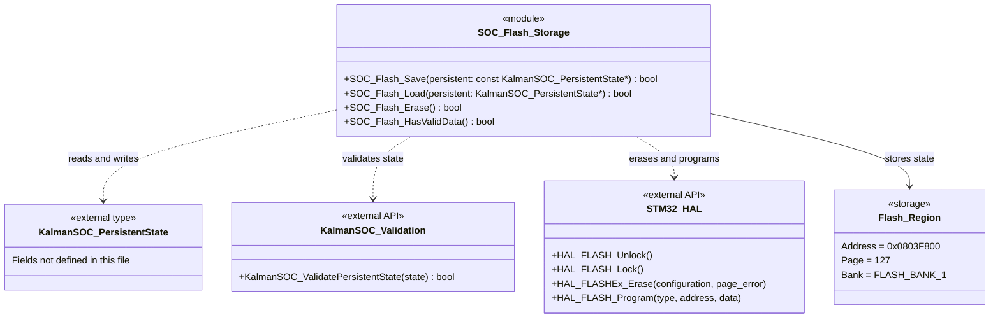

# SOC Flash Storage — Technical Specification

## Overview

`soc_flash_storage.cpp` implements flash persistence for `KalmanSOC_PersistentState`. It provides operations to save, load, erase, and check stored state.

The implementation exposes free functions rather than a C++ class. The diagram groups these functions into a module for documentation.

## Module Diagram



## Storage Configuration

| Property | Configuration |
|---|---|
| Documented target | NUCLEO-G474RE / STM32G474RET6 |
| Documented total flash | 512 KB |
| Documented page size | 2 KB |
| Storage address | `0x0803F800UL` |
| Erase bank | `FLASH_BANK_1` |
| Erase page | `127` |
| Pages erased per operation | `1` |
| Programming unit | 8 bytes |
| Stored representation | Raw bytes of `KalmanSOC_PersistentState` |
| Programming operation count | `(sizeof(KalmanSOC_PersistentState) + 7) / 8` |

The configured address follows the calculation:

```text
0x08000000 + (127 × 2048) = 0x0803F800
```

The opening comment refers to Bank 2, but the implementation selects **Bank 1, Page 127**. Bootloader placement and linker reservation are not established by this file.

## Function Specifications

### `SOC_Flash_Save`

```cpp
bool SOC_Flash_Save(const KalmanSOC_PersistentState* persistent);
```

**Purpose:** Replace the stored state with the supplied state.

| Item | Description |
|---|---|
| Input | Pointer to the state to store |
| Platform condition | Flash operations compile only when `STM32G4` is defined |
| Success | Returns `true` after all erase and programming calls return `HAL_OK` |
| Failure | Returns `false` on erase/program failure or an unsupported compile path |
| Side effects | Erases the selected page and programs the replacement state |

**Processing sequence:**

1. Call `HAL_FLASH_Unlock()`.
2. Configure a single-page erase using the storage bank and page constants.
3. Call `HAL_FLASHEx_Erase()`.
4. On erase failure, lock flash and return `false`.
5. Read and program successive eight-byte values from the input object.
6. On programming failure, lock flash and return `false`.
7. Lock flash and return `true`.

**Contract limitations:** No input validation, null-pointer check, storage-size check, or read-back verification is performed. Unlock and lock results are ignored. Erasing occurs before replacement data is written.

### `SOC_Flash_Load`

```cpp
bool SOC_Flash_Load(KalmanSOC_PersistentState* persistent);
```

**Purpose:** Copy stored state into RAM and validate it.

| Item | Description |
|---|---|
| Input/output | Pointer to a writable destination state |
| Platform condition | None |
| Return value | Result of `KalmanSOC_ValidatePersistentState(persistent)` |
| Side effects | Overwrites the destination before validation |

**Processing sequence:**

1. Interpret `SOC_FLASH_ADDRESS` as a pointer to stored state.
2. Copy `sizeof(KalmanSOC_PersistentState)` bytes into the destination using `memcpy()`.
3. Validate the copied state and return the result.

**Contract limitations:** The caller must supply a valid destination. A `false` result does not restore the destination’s previous contents. The validation criteria are defined outside this file.

### `SOC_Flash_Erase`

```cpp
bool SOC_Flash_Erase(void);
```

**Purpose:** Erase the page containing the persistent state.

| Item | Description |
|---|---|
| Input | None |
| Platform condition | Flash operations compile only when `STM32G474xx` is defined |
| Success | Returns `true` when the erase call returns `HAL_OK` |
| Failure | Returns `false` when erasure fails or the platform guard is absent |
| Side effects | Erases the entire configured page |

**Processing sequence:**

1. Call `HAL_FLASH_Unlock()`.
2. Configure and perform a single-page erase.
3. Call `HAL_FLASH_Lock()`.
4. Return whether the erase status equals `HAL_OK`.

**Contract limitations:** Unlock and lock results are ignored. Any other data sharing the selected page is also erased.

### `SOC_Flash_HasValidData`

```cpp
bool SOC_Flash_HasValidData(void);
```

**Purpose:** Check the stored state directly in flash.

| Item | Description |
|---|---|
| Input | None |
| Platform condition | None |
| Return value | Result of validating the state at `SOC_FLASH_ADDRESS` |
| Local behavior | Passes a flash-resident pointer directly to the validator |

The function does not copy the state into RAM. The validator’s implementation and validation criteria are outside this file.

## External Dependencies

| Dependency | Role within this module |
|---|---|
| `soc_flash_storage.h` | Included module header; contents are not shown |
| `kalman_soc.h` | Included SOC header; contents are not shown |
| `kalman_soc_config.h` | Included configuration header; no symbols are explicitly attributable to it from this snippet |
| `stm32g4xx_hal.h` | Included when `STM32G474xx` is defined; supplies the flash HAL interface |
| `KalmanSOC_PersistentState` | Defines the object layout and byte count stored in flash |
| `KalmanSOC_ValidatePersistentState()` | Supplies the validity result used by load and presence checks |
| `HAL_FLASH_Unlock()` | Called before flash modifications |
| `HAL_FLASH_Lock()` | Called after modifications and handled failures |
| `HAL_FLASHEx_Erase()` | Performs the configured page erase |
| `HAL_FLASH_Program()` | Programs successive eight-byte values |
| `memcpy()` | Copies flash contents into the caller’s destination |

## Constraints and Known Issues

| Area | Observed behavior | Implication |
|---|---|---|
| Platform guards | Save uses `STM32G4`; HAL inclusion and erase use `STM32G474xx` | Build definitions may enable inconsistent paths |
| Platform reads | Load and validity checks are unguarded | They require the configured address to be readable |
| Input handling | Pointer arguments are not checked | Invalid pointers can cause invalid memory access |
| Final write | Write count rounds up to eight bytes | A structure size not divisible by eight causes a read beyond the object |
| Source access | Input is cast to `uint64_t*` | Alignment and C++ aliasing requirements may be violated |
| Capacity | No page-size bound is enforced | An oversized state can write beyond the erased page |
| Replacement | Erase precedes programming | Failure or power loss can leave no valid saved state |
| Verification | No post-write comparison or validation | Success reflects HAL statuses only |
| Error reporting | `page_error` is supplied but not inspected | Callers receive only a Boolean result |
| Flash ownership | No linker reservation is shown | Exclusive use of the page must be established elsewhere |
| Serialization | The structure is stored as raw memory | Format compatibility depends on its layout and external validation |